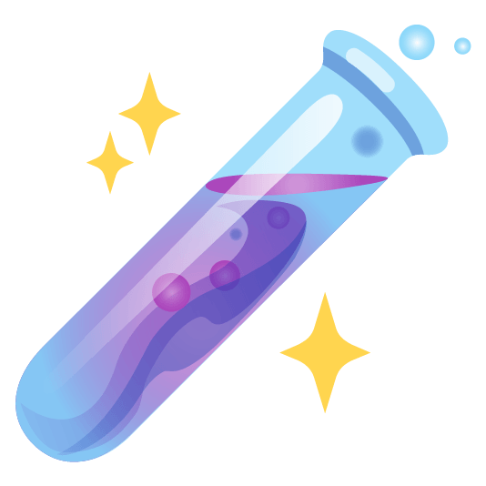

# Awesome Deep Learning in Analytical Chemistry

> Analytical chemistry studies and uses instruments and methods to separate, identify, and quantify matter. 
> 
> *from [Wikipedia](https://en.wikipedia.org/wiki/Analytical_chemistry)*

Keep updating the awesome deep-learning papers and codes related to analytical chemistry. Please notice that awesome lists are curations of the best, not everything. [Contributes](contributing.md) are always welcome! 

## Contents

* [Databases](#databases)
* [Papers](#papers)
    * [Survey papers](#survey-papers)
    * [Small molecular representation](#small-molecular-representation-learning)
        * [Discussions in pre-train models](#discussion-in-pretrain-models)
        * [Point-based (or quantum-based) methods](#point-based-or-quantum-based-methods)
        * [Graph-based methods](#graph-based-methods)
        * [Sequence-based methods](#sequence-based-methods)
    * [Analytical chemistry-related properties prediction](#analytical_chem_prediction)
        * [Tandem mass spectra prediction](#msms-predicton)
        * [Retention time prediction](#retetntion-time-prediction)
        * [Collision cross section prediction](#collision-cross-section-prediction)
    * [Small molecular generation](#small_molecular_generation)
        * [RL-based generators](#rl_gen)
        * [SL-based generator - molecular conformation](#sl_gen_conf)
        * [UL-based & SSL-based generator - molecular graph](#ul_ssl_gen_graph)
        * [UL-based & SSL-based generator - SMILES string](#ul_ssl_gen_smiles)
    * [Small molecular optimization](#small_molecular_optimization)
* [Related awesome lists](#related-awesome-lists)

## Databases

**Quantum properties**: 

- [QM9](https://www.nature.com/articles/sdata201422): This dataset includes the computed geometric, energetic, electronic, and thermodynamic properties of 134,000 stable small organic molecules composed of CHONF.
- [GEOM](https://nature.com/articles/s41597-022-01288-4): This dataset features 37 million molecular conformations for over 450,000 molecules, generated using advanced sampling and semi-empirical density functional theory (DFT).
- [MD17 & MD22](http://www.sgdml.org/): The MD22 benchmark dataset includes molecular dynamics trajectories of seven biomolecular and supramolecular systems, with atom counts ranging from 42 to 370, sampled at 400-500 K with 1 fs resolution, and energy and forces calculated using PBE+MBD theory. 

**MS/MS**: 

- [NIST23](https://www.sisweb.com/software/nist-msms.htm): The NIST MS/MS Library 2023 is a collection of MS/MS spectra and search software. It contains 2,374,064 MS/MS spectra from 399,267 small molecules.
- [MoNA](https://mona.fiehnlab.ucdavis.edu/): MoNA currently contains 2,061,612 mass spectral records from experimental and in-silico libraries, as well as from user contributions.
- [GNPS](https://gnps.ucsd.edu/ProteoSAFe/static/gnps-splash.jsp): GNPS is a web-based mass spectrometry ecosystem that aims to be an open-access knowledge base for the community-wide organization and sharing of raw, processed, or annotated fragmentation mass spectrometry data (MS/MS).

**Retention time**: 

- [SMRT](https://www.nature.com/articles/s41467-019-13680-7): This dataset presents an experimentally acquired reverse-phase chromatography retention time dataset, covering up to 80,038 small molecules.
- [RepoRT](https://chemrxiv.org/engage/chemrxiv/article-details/64a5a08c9ea64cc1677e120f): RepoRT currently contains 373 datasets, 8,809 unique compounds, and 88,325 retention time entries measured on 49 different chromatographic columns using various eluents, flow rates, and temperatures.

**Collision cross section**: 

- [AllCCS](https://www.nature.com/articles/s41467-020-18171-8): This collection includes more than 5,000 experimental CCS records and approximately 12 million calculated CCS values for over 1.6 million small molecules.

## Papers

### Survey papers

- [TrAC 2021] Debus, Bruno, et al. [Deep learning in analytical chemistry](https://www.sciencedirect.com/science/article/pii/S016599362100282X?casa_token=f08kOPFgTDgAAAAA:AAbouNgCvOuFF23E38NFx8zzJ_0LGcCOVK5LrdzkdH5LzX4xHKcFALgD1Ckxg2Q8vZ8H78zNZW8)
- [IJCAI 2023] Xia, Jun, et al. [A Systematic Survey of Chemical Pre-trained Models](https://www.ijcai.org/proceedings/2023/760)

### Small molecular representation learning

According to the information embedded in the model, the molecular representation learning models are categorized as point-based (or quantum-based) methods, graph-based methods, and sequence-based methods. Because the number of graph-based methods is huge, they are further divided into self-supervised learning and supervised learning manners. It is worth noting that the difference between point-based (or quantum-based) methods and graph-based methods is if bonds (i.e. edges) are included in the encoding. 

**Discussions in pre-train models** 

- [JCIM 2023] Zhang, Ziqiao, et al. [Can Pre-trained Models Really Learn Better Molecular Representations for AI-aided Drug Discovery?](https://pubs.acs.org/doi/10.1021/acs.jcim.3c01707)
- [NeurIPS 2022] Sun, Ruoxi, et al. [Does GNN Pretraining Help Molecular Representation?](https://proceedings.neurips.cc/paper_files/paper/2022/hash/4ec360efb3f52643ac43fda570ec0118-Abstract-Conference.html)

**Point-based (or quantum-based) methods** 

- [ICLR 2023] Zhou, Gengmo, et al. [Uni-mol: A universal 3d molecular representation learning framework](https://chemrxiv.org/engage/chemrxiv/article-details/6402990d37e01856dc1d1581) [\[code\]](https://github.com/dptech-corp/Uni-Mol)
- [PMLR 2021] Schütt, Kristof, et al. [Equivariant message passing for the prediction of tensorial properties and molecular spectra](https://proceedings.mlr.press/v139/schutt21a.html?ref=https://githubhelp.com) [\[code\]](https://github.com/atomistic-machine-learning/schnetpack)
- [NeurIPS 2017] Schütt, Kristof, et al. [Schnet: A continuous-filter convolutional neural network for modeling quantum interactions](https://proceedings.neurips.cc/paper/2017/hash/303ed4c69846ab36c2904d3ba8573050-Abstract.html) [\[code\]](https://github.com/atomistic-machine-learning/SchNet)

**Graph-based methods** 

*Self-Supervised Learning:*

- [Brief. Bioinformatics 2024] Zhen, Wang, et al. [BatmanNet: bi-branch masked graph transformer autoencoder for molecular representation](https://academic.oup.com/bib/article/25/1/bbad400/7455246) [\[code\]](https://github.com/wz-create/BatmanNet)
- [Bioinformatics 2023] [3DGCL] Moon, Kisung, et al. [3D graph contrastive learning for molecular property prediction](https://academic.oup.com/bioinformatics/article/39/6/btad371/7192173) [\[code\]](https://github.com/moonkisung/3DGCL)
- [ICLR 2023] [Mole-BERT] Xia, Jun, et al. [Mole-bert: Rethinking pre-training graph neural networks for molecules](https://openreview.net/forum?id=jevY-DtiZTR) [\[code\]](https://github.com/junxia97/Mole-BERT/tree/2feff8a33e3634b66b7408e2e2780fc9d960909f)
- [ICLR 2023 (spotlight)] [GNS TAT] Zaidi, Sheheryar, et al. [Pre-training via denoising for molecular property prediction](https://arxiv.org/abs/2206.00133) [\[code\]](https://github.com/shehzaidi/pre-training-via-denoising)
- [ICLR 2023] [GeoSSL-DDM] Liu, Shengchao, et al. [Molecular geometry pretraining with se (3)-invariant denoising distance matching](https://arxiv.org/abs/2206.13602) [\[code\]](https://github.com/chao1224/GeoSSL)
- [ICLR 2022] [GraphMVP] Liu, Shengchao, et al. [Pre-training molecular graph representation with 3d geometry](https://arxiv.org/abs/2110.07728) [\[code\]](https://github.com/chao1224/GraphMVP)
- [NeurIPS 2021] [MGSSL] Zhang, Zaixi, et al. [Motif-based graph self-supervised learning for molecular property prediction](https://arxiv.org/abs/2110.00987) [\[code\]](https://github.com/zaixizhang/MGSSL)
- [NeurIPS 2020] [GROVER] Rong, Yu, et al. [Self-supervised graph transformer on large-scale molecular data](https://proceedings.neurips.cc/paper/2020/hash/94aef38441efa3380a3bed3faf1f9d5d-Abstract.html) [\[code\]](https://github.com/tencent-ailab/grover)
- [ICLR 2020] [InfoGraph] Sun, Fan-Yun, et al. [Infograph: Unsupervised and semi-supervised graph-level representation learning via mutual information maximization](https://arxiv.org/abs/1908.01000) [\[code\]](https://github.com/sunfanyunn/InfoGraph)

*Supervised Learning*

- [AAAI 2023] [Molformer] Wu, Fang, et al. [Molformer: Motif-based transformer on 3d heterogeneous molecular graphs](https://ojs.aaai.org/index.php/AAAI/article/view/25662) [\[code\]](https://github.com/smiles724/Molformer/tree/master)
- [NeurIPS 2022] [ComENet] Wang, Limei, et al. [ComENet: Towards Complete and Efficient Message Passing for 3D Molecular Graphs](https://openreview.net/forum?id=mCzMqeWSFJ) [\[code (implemented in DIG library)\]](https://github.com/divelab/DIG/blob/b54e27e5660f0a8ba31dbc7d3f056f872b1f3e8e/dig/threedgraph/method/comenet/ocp/README.md)
- [ICLR 2022] [GNS+Noisy Nodes] Godwin, Jonathan, et al. [Simple GNN regularisation for 3D molecular property prediction & beyond](https://arxiv.org/abs/2106.07971) [\[codes\]](https://github.com/Namkyeong/NoisyNodes_Pytorch)
- [ICLR 2022] [MolR] Wang, Hongwei, et al. [Chemical-reaction-aware molecule representation learning](https://arxiv.org/abs/2109.09888) [\[code\]](https://github.com/hwwang55/MolR)
- [ICLR 2022] [SphereNet] Liu, Yi, et al. [Spherical message passing for 3d graph networks](https://arxiv.org/abs/2102.05013) [\[code (implemented in DIG library)\]](https://github.com/divelab/DIG)
- [Nat. Mach. Intell. 2022] [GEM] Fang, Xiaomin, et al. [Geometry-enhanced molecular representation learning for property prediction](https://www.nature.com/articles/s42256-021-00438-4) [\[code\]](https://github.com/PaddlePaddle/PaddleHelix/tree/dev/apps/pretrained_compound/ChemRL/GEM)
- [NeurIPS 2021] [GemNet] Gasteiger, Johannes, et al. [Gemnet: Universal directional graph neural networks for molecules](https://proceedings.neurips.cc/paper/2021/hash/35cf8659cfcb13224cbd47863a34fc58-Abstract.html) [\[code\]](https://github.com/TUM-DAML/gemnet_pytorch)
- [NeurIPS 2020] [DimeNet++] Klicpera, Johannes, et al. [Fast and uncertainty-aware directional message passing for non-equilibrium molecules](https://arxiv.org/abs/2011.14115) [\[code\]](https://github.com/gasteigerjo/dimenet)
- [ICLR 2020] [DimeNet] Gasteiger, Johannes, et al. [Directional message passing for molecular graphs](https://arxiv.org/abs/2003.03123) [\[code\]](https://github.com/gasteigerjo/dimenet)
- [Chem. Mater 2019] [MEGNet] Chen, Chi, et al. [Graph networks as a universal machine learning framework for molecules and crystals](https://pubs.acs.org/doi/full/10.1021/acs.chemmater.9b01294?casa_token=Qt91hGc97ywAAAAA%3A_uRAvtFkZVg-YHOeSw1mgP5K-pHBPqUpErJFugRveatjcHKJzcsoQACGsBbIxXJ0CFrY2Ug2jnXgcA) [\[preprint\]](https://arxiv.org/abs/1812.05055) [\[code\]](https://github.com/materialsvirtuallab/megnet)
- [PMLR 2017] Gilmer, Justin, et al. [Neural message passing for quantum chemistry](https://proceedings.mlr.press/v70/gilmer17a) [\[code\]](https://github.com/brain-research/mpnn)
- [NeurIPS 2015] [Neural FPs] Duvenaud, David K., et al. [Convolutional networks on graphs for learning molecular fingerprints](https://proceedings.neurips.cc/paper/2015/hash/f9be311e65d81a9ad8150a60844bb94c-Abstract.html) [\[code\]](https://github.com/HIPS/neural-fingerprint)

*Other Related Works*

- [NeurIPS 2020] You, Yuning, et al. [Graph contrastive learning with augmentations](https://proceedings.neurips.cc/paper/2020/hash/3fe230348e9a12c13120749e3f9fa4cd-Abstract.html) [\[code\]](https://github.com/Shen-Lab/GraphCL)
- [ICLR 2020] Hu, Weihua, et al. [Strategies for pre-training graph neural networks](https://arxiv.org/abs/1905.12265) [\[code\]](https://github.com/snap-stanford/pretrain-gnns/)

**Sequence-based methods** 

- [BCB 2019] [SMILES-BERT] Wang, Sheng, et al. [SMILES-BERT: large scale unsupervised pre-training for molecular property prediction](https://dl.acm.org/doi/abs/10.1145/3307339.3342186?casa_token=ROSIBxMX2UkAAAAA:q9M-DLpNJozQWqWEABwskuANeWuj8dPhU9ijopTfmnXJw3l7bjUuKEXI-br4yc4PG5cxVU5MT5Y) [\[code\]](https://github.com/uta-smile/SMILES-BERT)

### Analytical chemistry-related properties prediction 

**Tandem mass spectra prediction predicton** 

- [Nat. Mach. Intell. 2023] Goldman, Samuel, et al. [Annotating metabolite mass spectra with domain-inspired chemical formula transformers](https://www.nature.com/articles/s42256-023-00708-3) [\[code\]](https://github.com/samgoldman97/mist)
- [arxiv 2023] Young, Adamo, et al. [MassFormer: Tandem mass spectrum prediction with graph transformers](https://arxiv.org/abs/2111.04824) [\[code\]](https://github.com/Roestlab/massformer)
- [NeurIPS 2023] Goldman, Samuel, et al. [Prefix-tree decoding for predicting mass spectra from molecules](https://arxiv.org/abs/2303.06470) [\[code\]](https://github.com/samgoldman97/ms-pred)
- [Bioinformatics 2023] Hong, Yuhui, et al. [3DMolMS: prediction of tandem mass spectra from 3D molecular conformations](https://academic.oup.com/bioinformatics/article/39/6/btad354/7186501) [\[code\]](https://github.com/JosieHong/3DMolMS)
- [Anal. Chem. 2021] Wang, Fei, et al. [CFM-ID 4.0: more accurate ESI-MS/MS spectral prediction and compound identification](https://pubs.acs.org/doi/full/10.1021/acs.analchem.1c01465) [\[code\]](https://hub.docker.com/r/wishartlab/cfmid)
- [ACS Cent. Sci. 2019] Wei, Jennifer N., et al. [Rapid prediction of electron–ionization mass spectrometry using neural networks](https://pubs.acs.org/doi/full/10.1021/acscentsci.9b00085) [\[code\]](https://github.com/brain-research/deep-molecular-massspec)

**Retetntion time prediction** 

- [Anal. Chem. 2021] [GNN-RT] Yang, Qiong, et al. [Prediction of liquid chromatographic retention time with graph neural networks to assist in small molecule identification](https://pubs.acs.org/doi/full/10.1021/acs.analchem.0c04071?casa_token=mO9pC4-KcigAAAAA%3AMyHrVQdgHbaj9-vV0X3r2YyL6tvEgn8KXSgsK8LRVUpnKRoyPwO620Rd9somu561yuI_sqJ7D61sxyz_) [\[code\]](https://github.com/Qiong-Yang/GNN-RT)
- [Anal. Chem. 2020] [Retip] Bonini, Paolo, et al. [Retip: retention time prediction for compound annotation in untargeted metabolomics](https://pubs.acs.org/doi/full/10.1021/acs.analchem.9b05765?casa_token=od9yhAcRC4YAAAAA%3Acw-9j5x9v0EspjnV3R29eVa0yX1y_jAzvldPofoim-_ryvZwJ1hZA1_4ijaEl5k1wFHYvJ-W-L4t6JiI) [\[code\]](https://www.retip.app/)
- [Nat. Commun 2019] Domingo-Almenara, Xavier, et al. [The METLIN small molecule dataset for machine learning-based retention time prediction](https://www.nature.com/articles/s41467-019-13680-7) [\[code\]](https://figshare.com/articles/dataset/The_METLIN_small_molecule_dataset_for_machine_learning-based_retention_time_prediction/8038913)

**Collision cross section prediction** 

- [Anal. Chem. 2022] [AllCCS2] Zhang, Haosong, et al. [AllCCS2: Curation of Ion Mobility Collision Cross-Section Atlas for Small Molecules Using Comprehensive Molecular Representations](https://pubs.acs.org/doi/full/10.1021/acs.analchem.3c02267?casa_token=ploVY56aIwAAAAAA%3AXxRQix-0R_Ui8w7ektuTCYyXub4DGfg65KHkTVMTvisspPCEiAhRdq3MBofdHE0Xv6yMKZE7W69mFv4v) [\[code\]](http://allccs.zhulab.cn/)
- [Anal. Chem. 2021] [CCSP 2.0] Rainey, Markace A., et al. [CCS Predictor 2.0: An open-source jupyter notebook tool for filtering out false positives in metabolomics](https://pubs.acs.org/doi/full/10.1021/acs.analchem.2c03491?casa_token=EIp4r9idQT0AAAAA%3Aq-nm39gY0fiQqfpkgQhf3v9cvUWTUpwmEj_qb8dENafbRtV53R0YUbTWpwdL-VGHLycHPMEGIUaTA-C3) [\[code\]](https://github.com/facundof2016/CCSP2.0)
- [Nat. Commun 2020] [AllCCS] Zhou, Zhiwei, et al. [Ion mobility collision cross-section atlas for known and unknown metabolite annotation in untargeted metabolomics](https://www.nature.com/articles/s41467-020-18171-8) [\[code\]](https://github.com/ZhuMetLab/AllCCS)
- [Anal. Chem. 2019] [DeepCCS] Plante, Pier-Luc, et al. [Predicting ion mobility collision cross-sections using a deep neural network: DeepCCS](https://pubs.acs.org/doi/full/10.1021/acs.analchem.8b05821?casa_token=kUbfnZd1X7UAAAAA%3A5cfF6_3stVXfTgxMgmR8oeYXVNodkXKURjuZgzdHhXMyewwES3jYgNQbwhwEyl_7Xenag4Zpi4qA0PGA) [\[code\]](https://github.com/plpla/DeepCCS/)

### Small molecular generation 

Based on the training strategies, deep molecular generative models can be classified into two categories: reinforcement learning (RL)-based methods, which generate molecules with desired properties; unsupervised (UL)-based or self-supervised (SSL)-based methods, which aim to generate valid, novel, and diverse molecules; supervised (SL)-based methods generating molecular three-dimensional conformations from molecular graphs. 

**RL-based generators** 

- [NeurIPS 2018] [GCPN] You, Jiaxuan, et al. [Graph convolutional policy network for goal-directed molecular graph generation](https://proceedings.neurips.cc/paper/2018/hash/d60678e8f2ba9c540798ebbde31177e8-Abstract.html) [\[code\]](https://github.com/bowenliu16/rl_graph_generation)
- [Sci. Adv. 2018] [ReLeaSE] Popova, Mariya, et al. [Deep reinforcement learning for de novo drug design](https://www.science.org/doi/10.1126/sciadv.aap7885) [\[code\]](https://github.com/isayev/ReLeaSE)

**SL-based generator - molecular conformation** 

- [ICLR 2022 (Oral)] [GeoDiff] Xu, Minkai, et al. [Geodiff: A geometric diffusion model for molecular conformation generation](https://openreview.net/forum?id=PzcvxEMzvQC) [\[code\]](https://github.com/MinkaiXu/GeoDiff)
- [NeurIPS 2022] [torsional diffusion] Jing, Bowen, et al. [Torsional diffusion for molecular conformer generation](https://arxiv.org/abs/2206.01729) [\[code\]](https://github.com/gcorso/torsional-diffusion)
- [TMLR 2022] [DMCG] Zhu, Jinhua, et al. [Direct molecular conformation generation](https://arxiv.org/abs/2202.01356) [\[code\]](https://github.com/DirectMolecularConfGen/DMCG)
- [NeurIPS 2021] [GeoMol] Ganea, Octavian, et al. [Geomol: Torsional geometric generation of molecular 3d conformer ensembles](https://proceedings.neurips.cc/paper/2021/hash/725215ed82ab6306919b485b81ff9615-Abstract.html) [\[code\]](https://github.com/PattanaikL/GeoMol)
- [ICML 2021] [ConfGF] Shi, Chence, et al. [Learning gradient fields for molecular conformation generation](http://proceedings.mlr.press/v139/shi21b.html) [\[code\]](https://github.com/DeepGraphLearning/ConfGF)
- [ICML 2021] [ConfVAE] Xu, Minkai, et al. [An end-to-end framework for molecular conformation generation via bilevel programming](http://proceedings.mlr.press/v139/xu21f.html) [\[code\]](https://github.com/MinkaiXu/ConfVAE-ICML21)
- [ICLR 2021] [CGCF] Xu, Minkai, et al. [Learning neural generative dynamics for molecular conformation generation](https://arxiv.org/abs/2102.10240) [\[code\]](https://github.com/DeepGraphLearning/CGCF-ConfGen)
- [NeurIPS 2020] [TorsionNet] Gogineni, Tarun, et al. [Torsionnet: A reinforcement learning approach to sequential conformer search](https://proceedings.neurips.cc/paper/2020/hash/e904831f48e729f9ad8355a894334700-Abstract.html) [\[code\]](https://github.com/tarungog/torsionnet_paper_version)
- [ICML 2020] [GraphDG] Simm, Gregor NC, and José Miguel Hernández-Lobato. [A generative model for molecular distance geometry](https://arxiv.org/abs/1909.11459) [\[code\]](https://github.com/gncs/graphdg)
- [Sci. Rep. 2019] [CVGAE] Mansimov, Elman, et al. [Molecular geometry prediction using a deep generative graph neural network](https://www.nature.com/articles/s41598-019-56773-5) [\[code\]](https://github.com/nyu-dl/dl4chem-geometry)

**UL-based & SSL-based generator - molecular graph** 

- [ICLR 2022 (Oral)] [DEG] Guo, Minghao, et al. [Data-efficient graph grammar learning for molecular generation](https://openreview.net/forum?id=l4IHywGq6a) [\[code\]](https://github.com/gmh14/data_efficient_grammar)
- [ICML 2021] [GraphDF] Luo, Youzhi, et al. [Graphdf: A discrete flow model for molecular graph generation](https://proceedings.mlr.press/v139/luo21a.html) [\[code\]](https://github.com/lakshayguta/BTP/tree/378aac3ae9620aac43a995bcbfb71288593a04c9/DIG-main/dig/ggraph/GraphDF)
- [ICML 2020] [RationaleRL] Jin, Wengong, et al. [Multi-objective molecule generation using interpretable substructures](https://proceedings.mlr.press/v119/jin20b.html) [\[code\]](https://github.com/wengong-jin/multiobj-rationale)
- [ICLR 2020] [GraphAF] Shi, Chence, et al. [Graphaf: A flow-based autoregressive model for molecular graph generation](https://arxiv.org/abs/2001.09382) [\[code\]](https://github.com/DeepGraphLearning/GraphAF)
- [ICML 2020] [HierVAE] Jin, Wengong, et al. [Hierarchical generation of molecular graphs using structural motifs](https://proceedings.mlr.press/v119/jin20a.html) [\[code\]](https://github.com/wengong-jin/hgraph2graph/)
- [arXiv 2019] [GraphNVP] Madhawa, Kaushalya, et al. [Graphnvp: An invertible flow model for generating molecular graphs](https://arxiv.org/abs/1905.11600) [\[code\]](https://github.com/pfnet-research/graph-nvp)
- [NeurIPS 2018] [CGVAE] Liu, Qi, et al. [Constrained graph variational autoencoders for molecule design](https://proceedings.neurips.cc/paper/2018/hash/b8a03c5c15fcfa8dae0b03351eb1742f-Abstract.html) [\[code\]](https://github.com/drigoni/ConditionalCGVAE)
- [NeurIPS 2018] Ma, Tengfei, et al. [Constrained generation of semantically valid graphs via regularizing variational autoencoders](https://proceedings.neurips.cc/paper/2018/hash/1458e7509aa5f47ecfb92536e7dd1dc7-Abstract.html) 😢 No official codes are available.
- [ICML 2018] [JT-VAE] Jin, Wengong, et al. [Junction tree variational autoencoder for molecular graph generation](https://proceedings.mlr.press/v80/jin18a.html) [\[code\]](https://github.com/wengong-jin/icml18-jtnn)
- [ICML 2018] [MolGAN] De Cao, Nicola, and Thomas Kipf. [MolGAN: An implicit generative model for small molecular graphs](https://arxiv.org/abs/1805.11973) [\[code\]](https://github.com/nicola-decao/MolGAN)

**UL-based & SSL-based generator - SMILES string** 

- [Chem. Sci. 2021] [STONED] Nigam, AkshatKumar, et al. [Beyond generative models: superfast traversal, optimization, novelty, exploration and discovery (STONED) algorithm for molecules using SELFIES](https://pubs.rsc.org/en/content/articlehtml/2021/sc/d1sc00231g) [\[code\]](https://github.com/aspuru-guzik-group/stoned-selfies)
- [arXiv 2018] [ORGAN] Guimaraes, Gabriel Lima, et al. [Objective-reinforced generative adversarial networks (organ) for sequence generation models](https://arxiv.org/abs/1705.10843) [\[code\]](https://github.com/gablg1/ORGAN)
- [J Chem Inf Model 2018] [BIMODAL] Grisoni, Francesca, et al. [Bidirectional molecule generation with recurrent neural networks](https://pubs.acs.org/doi/full/10.1021/acs.jcim.9b00943) [\[code\]](https://github.com/ETHmodlab/BIMODAL)
- [ACS Cent. Sci. 2018] [VSeq2Seq] Gómez-Bombarelli, Rafael, et al. [Automatic chemical design using a data-driven continuous representation of molecules](https://pubs.acs.org/doi/10.1021/acscentsci.7b00572) [\[unofficial code\]](https://github.com/aksub99/molecular-vae) 😢 No official codes are available.
- [ACS Cent. Sci. 2018] Segler, Marwin HS, et al. [Generating focused molecule libraries for drug discovery with recurrent neural networks](https://pubs.acs.org/doi/full/10.1021/acscentsci.7b00512) [\[unofficial code\]](https://github.com/jaechanglim/molecule-generator) 😢 No official codes are available.
- [ICML/PMLR 2017] [GVAE] Kusner, Matt J., et al. [Grammar variational autoencoder](https://arxiv.org/abs/1703.01925) [\[code\]](https://github.com/mkusner/grammarVAE)

### Small molecular optimization 

While both molecular generation and optimization involve creating new molecules, generation is focused on creating entirely new molecules from scratch, while optimization is focused on improving the properties of existing molecules.

- [ICLR 2019] Jin, Wengong, et al. [Learning multimodal graph-to-graph translation for molecular optimization](https://arxiv.org/abs/1812.01070) [\[code\]](https://github.com/wengong-jin/iclr19-graph2graph)
- [Sci. Rep. 2019] [MolDQN] Zhou, Zhenpeng, et al. [Optimization of molecules via deep reinforcement learning](https://arxiv.org/abs/1810.08678) [\[code\]](https://github.com/google-research/google-research/tree/master/mol_dqn)

## Related awesome lists

- [Awesome Small Molecule Machine Learning](https://github.com/benb111/awesome-small-molecule-ml): This repository focuses on machine learning topics related to small molecules.
- [Awesome Cheminformatics](https://github.com/hsiaoyi0504/awesome-cheminformatics): This repository concentrates on computer-based methods in chemistry.
- [Awesome Python Chemistry](https://github.com/lmmentel/awesome-python-chemistry): This repository is dedicated to Python-based frameworks, libraries, software, and resources in the field of Chemistry.
- [Awesome DeepBio](https://github.com/gokceneraslan/awesome-deepbio) & [deeplearning-biology](https://github.com/hussius/deeplearning-biology): These repositories focus on deep learning methods in biology.
- [awesome-pretrain-on-molecules](https://github.com/junxia97/awesome-pretrain-on-molecules)